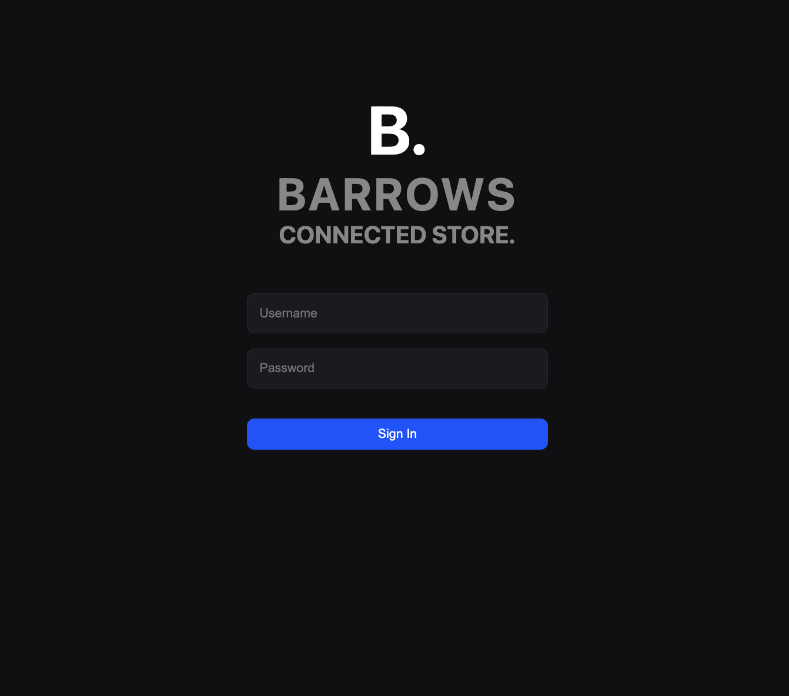
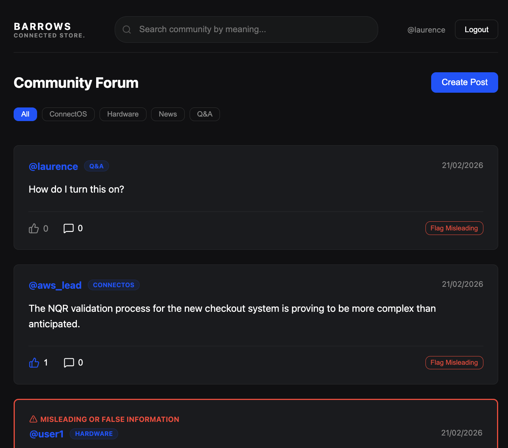

# Barrows Connected Stores: Technical Forum

A full-stack forum application featuring AI-powered semantic search, automated content categorization, and a premium dark-mode interface tailored for the Barrows Connected Stores ecosystem.




## 🚀 Features

- **Semantic Search**: Find posts by meaning rather than just keywords using `pgvector` and Gemini embeddings.
- **Automated Categorization**: Posts are automatically tagged (ConnectOS, Hardware, News, Q&A) using a KNN vector comparison.
- **Role-Based Permissions**: Distinct experiences for Moderators (content flagging) and Regular Users.
- **Real-Time UI**: High-performance React frontend with debounced live search and optimistic state updates.

## TODOs

- Forgot to add comment functionality. This is a core feature. Update postman collection.
- After we create a new post the page state is not refreshed. This means the user can attempt to like thier own post (not greyed out, still errors if they do) and the post categorization is not shown. We should either periodically refresh state (probably bad) or trigger an update on post, after a delay? Actually, we should probably artificially delay the frontend until the backend is ready.
- Want to add a way for user to see "why am I seeing these results" for semantic search. Could add some cool embedding visualizations.

---

## 🛠 Prerequisites

- **Python 3.11+**
- **Node.js 20+**
- **PostgreSQL 17** with the `pgvector` extension installed.
- **Google Gemini API Key** (for AI features).

---

## 🏗 Setup Instructions

### 1. Database Configuration

Ensure PostgreSQL 17 is running and run the following commands to set up the environment:

```sql
-- Connect to postgres
CREATE DATABASE webforum_db;
CREATE USER webforum_user WITH PASSWORD 'password123';
ALTER USER webforum_user WITH SUPERUSER; -- Required for pgvector extension during tests
GRANT ALL PRIVILEGES ON DATABASE webforum_db TO webforum_user;

-- Enable the vector extension
\c webforum_db
CREATE EXTENSION IF NOT EXISTS vector;
```

### 2. Backend Setup

```bash
# Clone the repository
git clone https://github.com/laurenceWalton/forum.git
cd forum

# Create and activate virtual environment
python3.11 -m venv barrows-env
source barrows-env/bin/activate

# Install dependencies
pip install -r requirements.txt

# Configure Environment
# Create a .env file in the root directory and add:
# GOOGLE_API_KEY=your_gemini_api_key_here

# Run Migrations
cd webforum
python manage.py migrate

# Load Golden Dataset (Users, AI Posts, Embeddings)
python manage.py loaddata ../dummy_data.json
```

### 3. Frontend Setup

```bash
cd webforum-frontend
npm install
```

---

## 🚦 Running the Project

You will need two terminal windows open:

### Terminal 1 (Backend)

```bash
cd webforum
python manage.py runserver
```

### Terminal 2 (Frontend)

```bash
cd webforum-frontend
npm run dev
```

Visit: `http://localhost:5173`

---

## 🧪 Testing and Demonstration

### User Accounts

You can log in with the following curated personas (all use password: `password123`):

- **Moderator**: `laurence` or `aws_lead`
- **Regular Users**: `sa_engineer`, `uk_manager`, `unilever_data`

### AI Semantic Search

Try searching for concepts like "payment point" or "connectivity issues" to see the AI find technical results without matching exact keywords.

### Postman Collection

The official API specification is located in `/postman/barrows_forum.postman_collection.json`. Import this into Postman to test all endpoints independently.

---

## 🧠 Architecture Notes

- **Backend**: Django 5.2 + Django REST Framework.
- **AI Layer**: `google-genai` SDK using `gemini-embedding-001` (3072 dimensions).
- **Database**: PostgreSQL 17 + `pgvector` for high-dimensional similarity searches.
- **Frontend**: React + Vite + TypeScript with Vanilla CSS variables.
